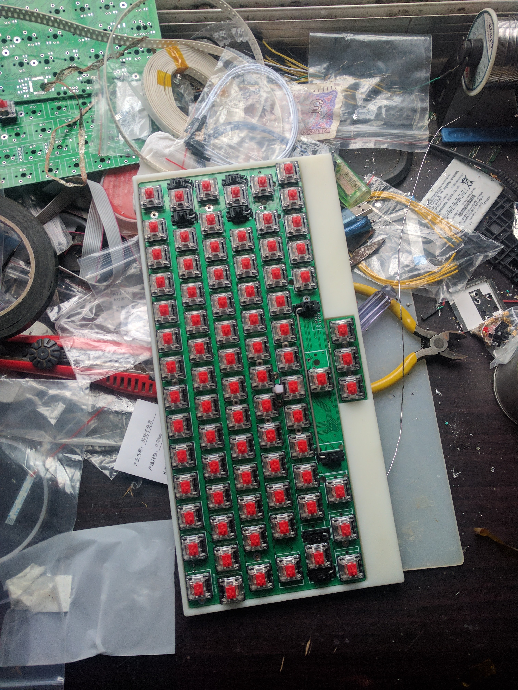
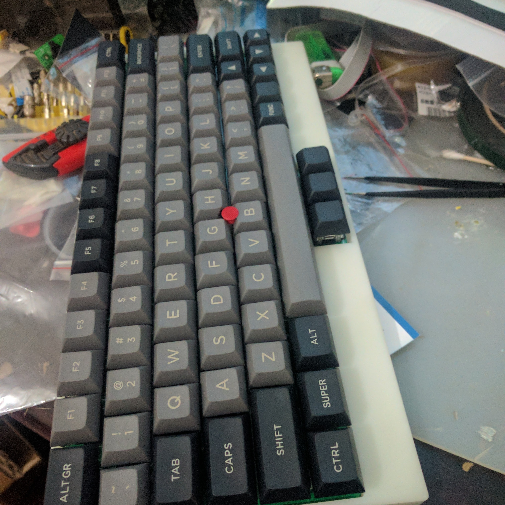

### 基于gh60键盘改的75键机械键盘，同时集成了ThinkPad的小红点模块
几年前折腾的，因为不需要gh60那些花里胡哨的灯扩展什么的，自己魔改了那些部分，集成了小红点功能, 改成了type c接口等。
同时扩展成75键，外壳使用openscad画的，然后用3d打印。实际效果大概：

最新的openscad文件没实际验证过，因为做到后面索然无味，没再继续折腾，可能图尺寸什么会有问题。